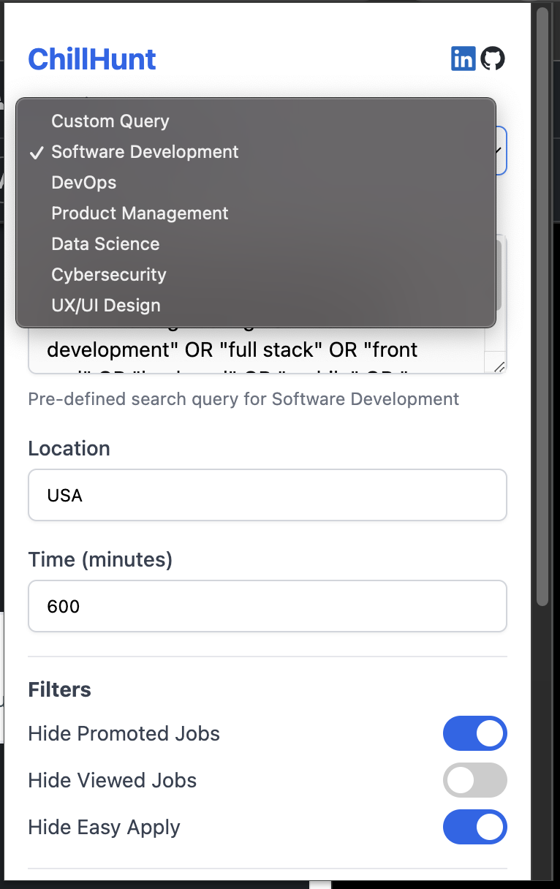
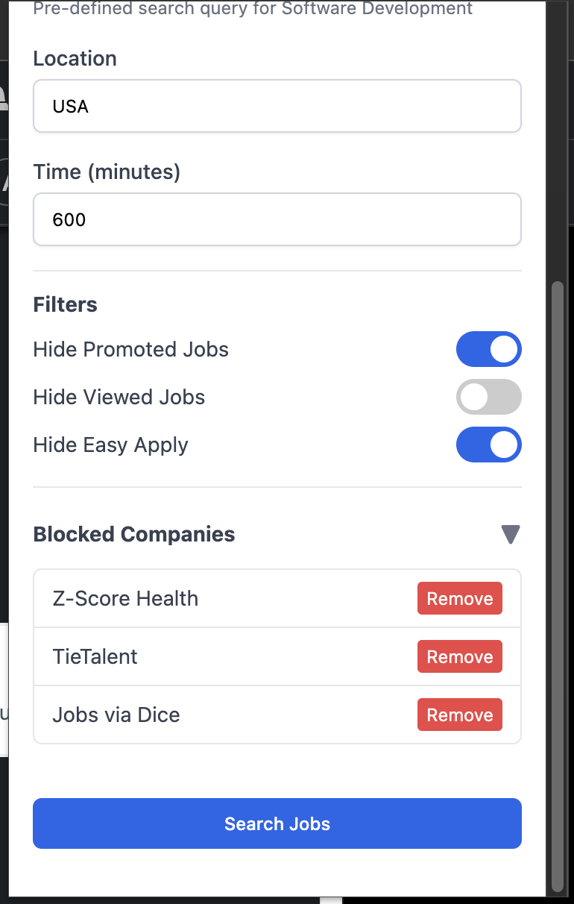
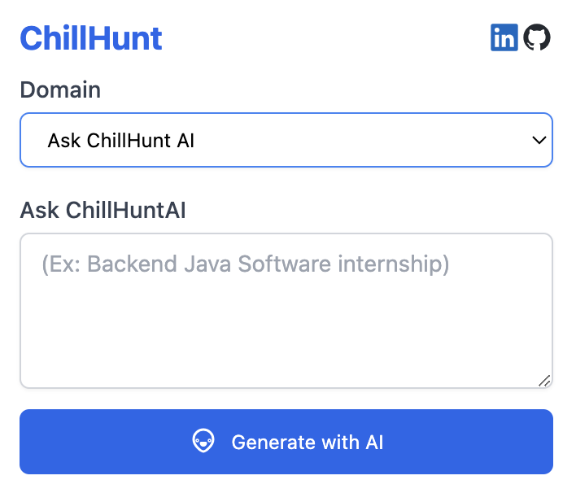

# ChillHunt

|  |  |  |
| :------------------------------------: | :------------------------------------: | :------------------------------------: |
|           ChillHunt Queries            |           ChillHunt Filters            |            ChillHunt Ask AI            |

Hey there! So I made this Chrome extension because I was tired of wasting time scrolling through LinkedIn's job spam. It helps cut through the noise and makes job hunting way less of a headache.

## What This Thing Does

- **Kills the Noise** : Hides promoted jobs, already viewed stuff, and those annoying "Easy Apply" listings that everyone applies to
- **Blocks Companies** : Got ghosted by Amazon for the 5th time? Block 'em with one click
- **Time Filters** : Shows jobs from last X minutes (with a handy mins→hours conversion)
- **Tech Domain Searches** : Ready-made searches for software dev, DevOps, data science, etc.
- **Custom Searches** : Make and save your own search filters
- **Clean Look** : Minimal interface that doesn't get in your way

## Getting It

### Quick Way

1. SOON LINK
2. Click "Add to Chrome"
3. Done

### Dev Way

1. Grab latest code from my [GitHub repo](https://github.com/xanf-code/linkedin-chillhunt)
2. Unzip it
3. Go to `chrome://extensions/`
4. Turn on "Developer mode" in the top-right
5. Hit "Load unpacked" and choose the folder
6. You're good to go

## How to Use It

### Searching

1. Click the ChillHunt icon
2. Pick a domain or type your own search
3. Add location if you want
4. Set time filters if needed
5. Hit "Search Jobs"

### Filtering

- Toggle switches to hide promoted junk, already viewed stuff, and Easy Apply jobs
- Each job listing will have a block button (⊘) next to the close button
- Click it to never see that company again

## Domain Searches

I've set up some ready-to-go searches for:

- **Software Dev** : Finds coding, web dev, mobile, backend/frontend stuff
- **DevOps** : Grabs cloud, infrastructure, SRE, platform engineering roles
- **Product** : Finds PM, APM, product owner gigs
- **Data Science** : Gets ML, AI, analytics, data engineering positions
- **Security** : Finds cybersecurity, infosec, app security roles
- **UX/UI** : Locates design, interaction, and visual/product design jobs

## The Extra Stuff

### Time Filtering

- Type minutes, see hours (because who thinks in minutes?)

### Company Blocking

- View your block list
- Unblock companies when you're feeling forgiving

## Building It Yourself

### You'll Need

- Node.js

### Setup

1. Clone it:

```bash
git clone https://github.com/xanf-code/linkedin-chillhunt
.git
cd chillhunt
```

2. Install stuff:

```bash
npm install
```

3. Build it:

```bash
npm run build
```

4. Load the `dist` folder as an unpacked extension

### Code Structure

```
chillhunt/
├── .env            # API key stored here (not committed)
├── .gitignore
├── package.json
├── webpack.config.js
├── dist/           # Built files go here (generated)
└── src/
    ├── content.js
    ├── popup.js
    ├── popup.html
    ├── manifest.json
    └── icons/
        └── icon.png
```

## Privacy Stuff

Your data stays on your computer:

- Nothing stored on servers
- No tracking
- No analytics
- Only asks for permissions it actually needs

## Want to Help?

Got ideas? Found bugs? Want to add features?

1. Fork it
2. Branch it (`git checkout -b cool-new-thing`)
3. Commit it (`git commit -m 'added this cool thing'`)
4. Push it (`git push origin cool-new-thing`)
5. Pull request it

## License

MIT License - do what you want with it, just don't sue me.

## Get in Touch

- GitHub: [@xanf-code](https://github.com/xanf-code)
- LinkedIn: [Darshan Aswath](https://www.linkedin.com/in/darshanaswath/)

## Thanks

- To everyone who's as annoyed by LinkedIn job search as I am
